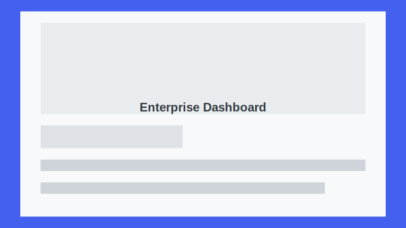

Perfect! Here's a **modern, visually appealing README** for your GitHub portfolio with badges, screenshots, and structured sections:

```markdown
# Aravinthaprasath V | Portfolio Website

[](https://aravinthvr.github.io/portfolio) 
[](https://creativecommons.org/licenses/by/4.0/)

A **modern, responsive portfolio website** showcasing my skills, projects, and professional experience in **Software Development Engineering** and **Data Science & Machine Learning**.

---

## 🔗 Live Demo
Check out the live portfolio: [https://aravinthvr.github.io/portfolio](https://aravinthvr.github.io/portfolio)

---

## 🎯 Features

- **Responsive Design:** Looks great on all devices  
- **Light/Dark Mode:** Toggle between themes  
- **Interactive UI:** Smooth animations & transitions  
- **Resume Section:** Different versions for SDE and DS/ML  
- **Project Showcase:** Filterable gallery  
- **Publications & Certifications:** Academic and professional achievements  
- **Contact Form & Email:** Easy ways to reach me  
  - Email: [shashankshatraboina@gmail.com](mailto:shashankshatraboina@gmail.com)

---

## 🛠 Technology Stack

- **Frontend:** HTML5, CSS3 (Flexbox, Grid, Custom Properties), Vanilla JS (ES6+)  
- **Architecture:** Component-based  
- **Icons & Fonts:** Font Awesome, Google Fonts  
- **Form Handling:** Formspree  

---

## 💻 Screenshots

### Home Page


### Projects


### Contact


---

## ⚙ Project Structure

```

portfolio/
├── index.html
├── css/
│   ├── base.css
│   ├── common.css
│   ├── responsive.css
│   ├── components/
├── components/
│   ├── header.html
│   ├── hero.html
│   └── ...
├── js/
│   ├── main.js
│   └── template-engine.js
├── assets/
│   ├── images/
│   ├── projects/
│   └── resumes/
└── README.md

````

---

## 🚀 Setup & Deployment

### GitHub Pages
1. Fork the repository  
2. Enable **GitHub Pages** in repository settings  
3. Your site will be available at `https://<your-username>.github.io/portfolio`

### Local Development
```bash
git clone https://github.com/aravinthvr/portfolio.git
cd portfolio
open index.html
````

---

## 🎨 Customization

* Update profile image in `assets/images/`
* Replace resume PDFs in `assets/resumes/`
* Modify project details in HTML
* Customize colors via CSS variables in `base.css`

---

## 📧 Contact

* **Email:** [shashankshatraboina@gmail.com](mailto:shashankshatraboina@gmail.com)
* **Contact Form:** Powered by Formspree

---

## 🏆 License

This project is licensed under the **Creative Commons Attribution 4.0 International License**.
You may use, modify, and share it, with proper credit to **Aravinthaprasath V**.

---

### Made with ❤️ by Aravinthaprasath V

```

---

If you want, I can **add a section for Skills & Technologies with visual badges/icons**, like **Python, JavaScript, React, SQL, Machine Learning**, so it looks even more professional on GitHub.  

Do you want me to do that next?
```


